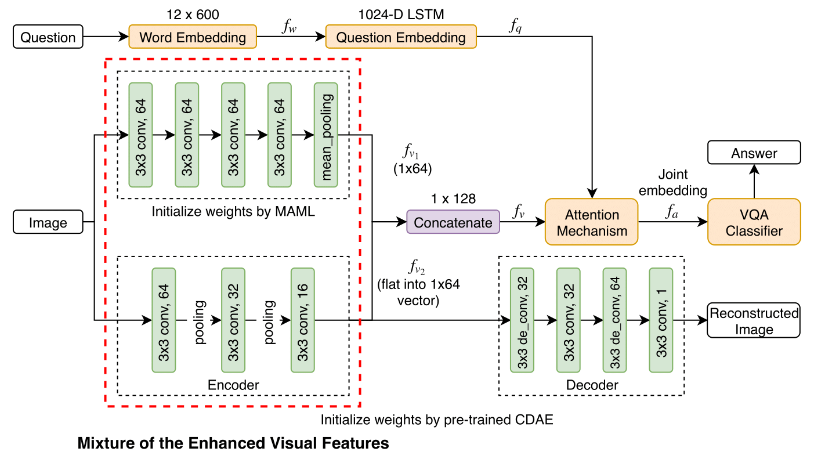

# Mixture of Enhanced Visual Features (MEVF)

This repository is the implementation of `MEVF` for the visual question answering task in medical domain. Our model achieved **43.9** for open-ended and **75.1** for close-end on [VQA-RAD dataset](https://www.nature.com/articles/sdata2018251#data-citations). For the detail, please refer to [link](https://arxiv.org/abs/1909.11867).

This repository is based on and inspired by @Jin-Hwa Kim's [work](https://github.com/jnhwkim/ban-vqa). We sincerely thank for their sharing of the codes.



### Prerequisites

Please install dependence package by run following command:
```
pip install -r requirements.txt
```

### Preprocessing

All data should be downloaded via [link](https://vision.aioz.io/f/777a3737ee904924bf0d/?dl=1). The downloaded file should be extracted to `data_RAD/` directory.

### Training
Train MEVF model with Stacked Attention Network
```
$ python3 main.py --model SAN --use_RAD --RAD_dir data_RAD --maml --autoencoder --output saved_models/SAN_MEVF
```
Train MEVF model with Bilinear Attention Network
```
$ python3 main.py --model BAN --use_RAD --RAD_dir data_RAD --maml --autoencoder --output saved_models/BAN_MEVF
```
The training scores will be printed every epoch.

|             | SAN+proposal | BAN+proposal |
|-------------|:------------:|:------------:|
| Open-ended  |     40.7     |     43.9     |
| Close-ended |     74.1     |     75.1     |

### Pretrained models and Testing
In this repo, we include the pre-trained weight of MAML and CDAE which are used for initializing the feature extraction modules.

The **MAML** model `data_RAD/pretrained_maml.weights` is trained by using official source code [link](https://github.com/cbfinn/maml).

The **CDAE** model `data_RAD/pretrained_ae.pth` is trained by code provided in `train_cdae.py`. For reproducing the pretrained model, please check the instruction provided in that file.

We also provide the pretrained models reported as the best single model in the paper.

For `SAN_MEVF` pretrained model. Please download the [link](https://vision.aioz.io/f/fdc6572bc26f4dd684f4/?dl=1) and move to `saved_models/SAN_MEVF/`. The trained `SAN_MEVF` model can be tested in VQA-RAD test set via:
```
$ python3 test.py --model SAN --use_RAD --RAD_dir data_RAD --maml --autoencoder --input saved_models/SAN_MEVF --epoch 19 --output results/SAN_MEVF
```
For `BAN_MEVF` pretrained model. Please download the [link](https://vision.aioz.io/f/882e8a6f32704013943d/?dl=1) and move to `saved_models/BAN_MEVF/`. The trained `BAN_MEVF` model can be tested in VQA-RAD test set via:
```
$ python3 test.py --model BAN --use_RAD --RAD_dir data_RAD --maml --autoencoder --input saved_models/BAN_MEVF --epoch 19 --output results/BAN_MEVF
```
The result json file can be found in the directory `results/`.

### Citation

Please cite these papers in your publications if it helps your research

```
@inproceedings{aioz_mevf_miccai19,
  author={Binh D. Nguyen, Thanh-Toan Do, Binh X. Nguyen, Tuong Do, Erman Tjiputra, Quang D. Tran},
  title={Overcoming Data Limitation in Medical Visual Question Answering},
  booktitle = {MICCAI},
  year={2019}
}
```

### License

MIT License

### More information
AIOZ AI Homepage: https://ai.aioz.io
AIOZ Network: https://aioz.network
